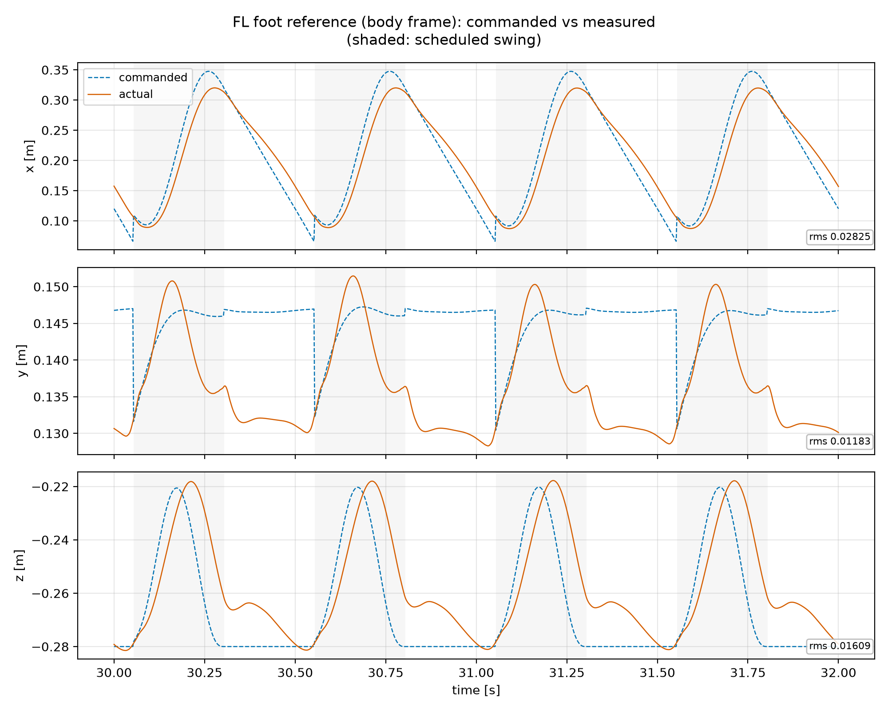
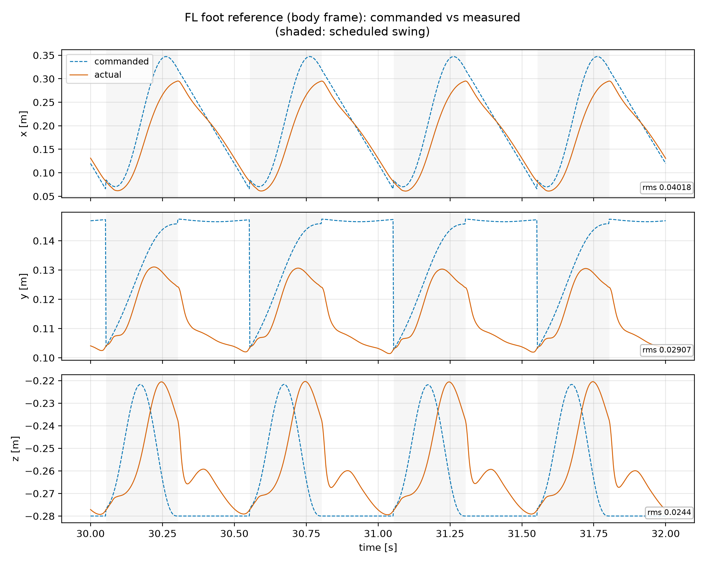
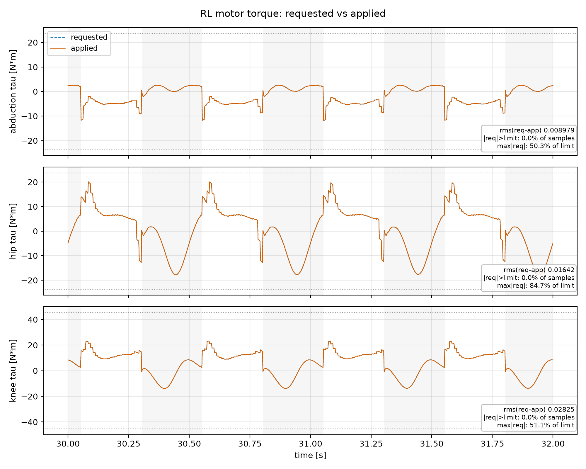
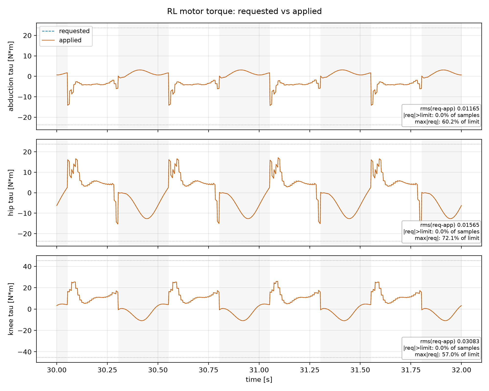
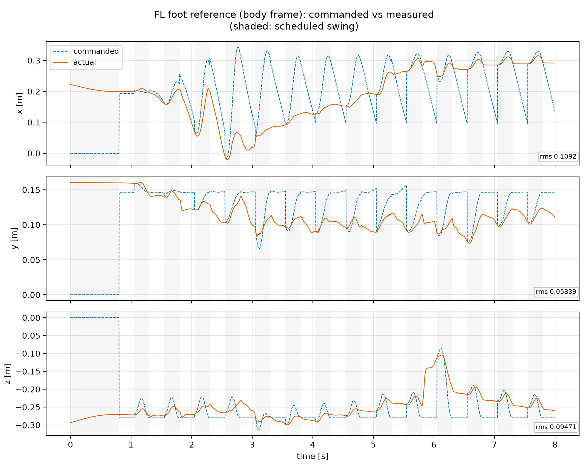

# Swing gain audit: `swing_inverse_dynamics`, horizon, and yaw weight

Read-only measurement. No file under `src/`, `include/`, `config/`, or `bin/`
was modified and no simulation was run for this report — all numbers come
from existing logs in `runs/stageC/*.mat` (see `reports/mpc/stage_a_envelope.md`
for the run-generation conventions this study reuses) and from swept
computation of the swing controller's own gain law. Pitch sign convention
throughout: **negative = nose down**; magnitudes are reported with that sign
stated once here rather than repeated per number.

## What was compared

Eleven cells, all Go2 in MuJoCo, all with ground truth on both estimator
stages (`orientationestimator.use_ground_truth = true`,
`posvelestimator.use_ground_truth = true`), all requesting 120 s of trot with
the torque-abort tripwire disabled, every varying parameter pinned explicitly
via `-c`:

- **s1 (`id0` vs `id1`)**: `swing_inverse_dynamics` false vs. true, at two
  operating points (`vx=1.05, horizon=20` and `vx=0.55, horizon=10`), holding
  `swing_natural_frequency = 28` where the apparent-mass branch is active.
- **s2 (`w40`/`w50`/`w60`)**: `swing_inverse_dynamics = true`, `vx=1.05`,
  `horizon=20`, sweeping only `swing_natural_frequency` (40, 50, 60), against
  the `id1` cell in s1 as the `omega=28` point of the same sweep.
- **s3 (`h10`/`h25`)**: `swing_inverse_dynamics = false` (fixed fallback),
  `vx=1.05`, sweeping only `mpc.horizon` (10, 20 from s1's `id0`, 25).
- **s4 (`yawW1`/`yawW0`)**: `swing_inverse_dynamics = true`, `vx=0.55`,
  `yaw_rate=0.5`, `horizon=10`, `omega=28`, sweeping only the MPC's yaw-angle
  state weight (1 vs. 0).

Everything not named as the swept parameter in a given group is held at the
shipped `trot.toml`/`mpc.toml` defaults. All eleven runs are summarized in
the table below; it is reproduced from the verified figures/measurements
supplied for this audit, not recomputed here.

| cell | swing_inverse_dynamics | v_x | horizon | omega_n | fell | pitch mean [mrad] | max abs pitch [mrad] | achieved v_x | touchdown x-err [mm] | mean height [m] |
|---|---|---|---|---|---|---|---|---|---|---|
| s1_id0_vx1.05_h20 | false | 1.05 | 20 | n/a | no | -82.6 | 103.1 | 0.913 | +28.2 | 0.302 |
| s1_id1_vx1.05_h20 | true | 1.05 | 20 | 28 | **YES t=5.44 s** | -437.7 | 885.3 | 0.261 | +114.0 | 0.292 |
| s1_id0_vx0.55_h10 | false | 0.55 | 10 | n/a | no | -18.3 | 30.0 | 0.505 | +16.4 | 0.295 |
| s1_id1_vx0.55_h10 | true | 0.55 | 10 | 28 | no | -35.2 | 55.4 | 0.520 | +50.5 | 0.291 |
| s2_w40 | true | 1.05 | 20 | 40 | no | -80.1 | 96.8 | 0.931 | +33.8 | 0.300 |
| s2_w50 | true | 1.05 | 20 | 50 | no | -77.6 | 96.2 | 0.911 | +16.2 | 0.304 |
| s2_w60 | true | 1.05 | 20 | 60 | no | -73.9 | 95.3 | 0.898 | +8.4 | 0.306 |
| s3_id0_vx1.05_h10 | false | 1.05 | 10 | n/a | no | -52.5 | 68.9 | 0.910 | +26.3 | 0.307 |
| s3_id0_vx1.05_h25 | false | 1.05 | 25 | n/a | no | -83.1 | 108.8 | 0.914 | +28.3 | 0.302 |
| s4_yawW1 | true | 0.55 (yaw 0.5) | 10 | 28 | no | -39.2 | 84.5 | 0.511 | +51.0 | 0.291 |
| s4_yawW0 | true | 0.55 (yaw 0.5) | 10 | 28 | no | -39.8 | 90.2 | 0.511 | +51.2 | 0.291 |

For `s1_id1_vx1.05_h20` (the fallen cell) the pitch/touchdown-error columns
above cover only the pre-fall window — 4.6 s and 36 touchdowns, against
roughly 800 touchdowns in every steady cell — and are **not comparable** to
the other rows' steady-state numbers. They describe the collapse, not a
tracking baseline.

## 1. What `swing_inverse_dynamics` changes, and what it does not

Tracing the command path from `MdlTrot`'s swing controller to the motor, the
two branches selected by `swing_inverse_dynamics` differ in exactly one
respect: the Cartesian gain used to turn foot-position/velocity error into a
force, and therefore the loop bandwidth that gain implies. Torque limiting
(`MdlLegControl.cc:63`, the compile-time `(23.7, 23.7, 45.43)` N·m Go2
limits), the joint-damping bookkeeping (`_jointDamping`, `MdlTrot.cc:384`),
and the emitted `pos/vel/kp/kd/tau` command fields are bit-identical between
the branches. Nothing downstream of the gain computation knows or cares
which branch produced it.

`swing_kp_cartesian = 800.0`, `swing_kd_cartesian = 8.0` (`trot.toml`) is the
flat fallback used when `swing_inverse_dynamics = false`. When it is `true`,
the gain instead follows the apparent-mass law from `swing_natural_frequency`
and `swing_damping_ratio`, evaluated at the leg's actual, pose-dependent
apparent mass along the configured swing arc (stride 262 mm, lift 50 mm) —
see [`swing_gains_vs_arc.png`](swing_gain_audit/swing_gains_vs_arc.png).
At `omega_n = 28`:

| quantity | apparent-mass (omega_n=28) | fixed fallback |
|---|---|---|
| kp_x | 214–514 N/m | 800 N/m flat |
| kp_y | 305–424 N/m | 800 N/m flat |
| kp_z | 475–761 N/m | 800 N/m flat |
| kd_x | 12.2–29.3 N·s/m | 8.0 flat |
| equivalent omega_eff | 28 rad/s constant (by construction) | 29–54 rad/s (pose-dependent) |
| equivalent zeta | 0.8 constant (by construction) | 0.16–0.27 (pose-dependent) |

The apparent-mass path's kp is **below 800 N/m on every axis at every point
on the configured arc**, most severely fore-aft (x), and its kd is **above
8 N·s/m everywhere**. This is the opposite of what the `trot.toml` comment
above `swing_inverse_dynamics` implies — it reads as the leg-dynamics-aware,
presumably stiffer/more-faithful option, but measured against the number it
replaces it is uniformly the **softer and more heavily damped** of the two.
Nothing about `swing_inverse_dynamics` itself is unsound; the gain law it
installs is simply a different, and at the shipped `omega_n = 28` a weaker,
servo than the flat 800/8 it replaces.

## 2. The apparent-mass scheme was tuned onto its own resonance

The swing trajectory's own fundamental is `2*pi/T_sw = 2*pi/0.25 s =
25.1 rad/s` (stance/swing split at duty 0.5, period 0.5 s). The shipped
`swing_natural_frequency = 28` puts the swing's own fundamental at
`25.1/28 = 0.90` of the loop bandwidth — essentially on resonance, where the
tracking error is largest and roughly 90 degrees out of phase with the
reference. That is consistent
with `s1_id1_vx1.05_h20` (`omega_n=28`, `swing_inverse_dynamics=true`)
falling at t=5.44 s while the otherwise-identical `swing_inverse_dynamics =
false` cell (`s1_id0_vx1.05_h20`) runs the full 120 s.

[`omega_sweep.png`](swing_gain_audit/omega_sweep.png) sweeps
`swing_natural_frequency` at fixed `vx=1.05, horizon=20`
(`s2_w40/w50/w60`, with the `s1_id1` `omega=28` cell as the low end of the
same sweep) and shows both touchdown x-error and mean nose-down pitch
falling monotonically as `omega_n` moves away from resonance:

Ratios below are `omega_swing / omega_n`, matching the x-axis of
`omega_sweep.png`: 1.00 is resonance and smaller is further from it.

| omega_n | ratio omega_swing/omega_n | touchdown x-err [mm] | pitch mean [mrad] |
|---|---|---|---|
| 28 (fell) | **0.90** | +114.0 (pre-fall only) | -437.7 (pre-fall only) |
| 40 | 0.63 | +33.8 | -80.1 |
| 50 | 0.50 | +16.2 | -77.6 |
| 60 | 0.42 | +8.4 | -73.9 |

At `omega_n = 60` the apparent-mass path **beats** the fixed fallback on
both metrics measured at the same operating point (`s1_id0_vx1.05_h20`:
+28.2 mm / -82.6 mrad) — 8.4 mm touchdown error against 28.2 mm, 73.9 mrad
nose-down pitch against 82.6 mrad — while retaining the property the
fallback cannot offer at any gain: a **pose-independent damping ratio of
0.8**, versus the fallback's pose-dependent 0.16–0.27 (underdamped by a
factor of 3–5 depending on where the leg is in its arc).
[`foot_reference_FL_w60.png`](swing_gain_audit/foot_reference_FL_w60.png)
and [`foot_reference_FL_fixed.png`](swing_gain_audit/foot_reference_FL_fixed.png)
show this directly over a 2 s / four-gait-cycle window (`t=30–32 s`,
`vx=1.05`): both branches track the commanded foot trajectory, but `w60`'s
swing return-to-reference at each liftoff is visibly tighter than the fixed
fallback's.

**The recommendation this supports is to raise `swing_natural_frequency`,
not to abandon `swing_inverse_dynamics`.** The scheme is not the wrong idea;
the shipped constant put it on resonance with the very trajectory it is
supposed to track.

### Torque cost of moving off resonance

Torque figures corroborate that the gain increase from `omega_n=28` to
`omega_n=60` is not free but is affordable at steady state.
[`torque_RL_w60.png`](swing_gain_audit/torque_RL_w60.png) (RL hip is the
worst-loaded joint in the fixed-fallback baseline; shown here for `w60` at
the same 30–32 s window) and
[`torque_RL_fixed.png`](swing_gain_audit/torque_RL_fixed.png) can be
compared directly against the saturation numbers in the table below: at
`vx=1.05` with the fixed fallback there is no saturation in steady state
(worst motor RL-hip at 101% of limit, 0.01% of samples over); the `omega_n=28`
collapse instead drives FR-hip to 259% of its 23.7 N·m limit — an order of
magnitude beyond the fixed fallback's worst case, and inside a swing loop
that had already become underdamped-into-resonant rather than merely soft.

## 3. Longer MPC horizon makes the nose-down worse, monotonically

Sweeping `mpc.horizon` at fixed `vx=1.05` with the fixed-fallback swing
(`swing_inverse_dynamics=false`, `s3_id0_vx1.05_h10/h25` plus `s1_id0`'s
`h20`) shows nose-down pitch rising monotonically with horizon while
achieved speed stays flat:

| horizon | pitch mean [mrad] | max abs pitch [mrad] | achieved v_x |
|---|---|---|---|
| 10 | -52.5 | 68.9 | 0.910 |
| 20 | -82.6 | 103.1 | 0.913 |
| 25 | -83.1 | 108.8 | 0.914 |

See [`horizon_pitch.png`](swing_gain_audit/horizon_pitch.png). Most of the
damage happens between h=10 and h=20 (+30.1 mrad); h=20 to h=25 adds only
0.5 mrad more, while achieved speed is unchanged to within 0.4 percentage
points across the whole sweep (0.910–0.914). This is consistent with
`reports/mpc/horizon_adjudication.html`'s finding that the QP's own pitch
prediction becomes worse than the constant-zero reference past about 0.1 s
of lookahead (10 steps at `dt=0.01`) — beyond that point in the horizon the
rigid-body model is contributing error to the plan rather than useful
foresight, which is exactly the range (h=10 → h=20 → h=25) where the pitch
cost here keeps climbing.

`config/default/mpc.toml`'s `state_weights` puts weight 1 on pitch angle,
weight 0 on pitch **rate**, against weight 50 on height — the MPC has no
term that penalizes how fast the trunk is pitching, only where it currently
sits, and a comparatively enormous incentive to hold height. A model whose
own pitch prediction is unreliable past 10 steps, combined with a cost that
does not dampen pitch rate directly, is a plausible mechanism for horizon
length amplifying rather than damping the nose-down trend; this report does
not isolate the weight structure as an independent cause, only notes it
alongside the horizon result.

## 4. Zeroing the MPC's yaw-angle weight does essentially nothing

`s4_yawW1` (yaw-angle state weight = 1) vs. `s4_yawW0` (weight = 0), both at
`vx=0.55`, commanded yaw rate 0.5 rad/s:

| yaw weight | pitch mean [mrad] | max abs pitch [mrad] | achieved yaw rate |
|---|---|---|---|
| 1 | -39.2 | 84.5 | 0.458 rad/s |
| 0 | -39.8 | 90.2 | 0.441 rad/s |

Pitch differs by 0.6 mrad, achieved yaw rate by 0.017 rad/s — both changes
are noise-scale next to the 0.5 rad/s command either weight achieves about
90–92% of. The reason the weight does not matter is structural: `_desYaw` is
bounded directly by `yaw_reference_clamp` regardless of what the MPC's cost
function does with it, and `_desYaw` also sets the direction of the velocity
reference (`v = Rz(_desYaw) * v_cmd`) — a rotation no state weight in the
cost can bound. The clamp, not the weight, is what fixed turning; the weight
is free to stay at its current value of 1.

## 5. What actually enabled longer horizons was QP contact compaction

Horizon 25 became affordable to run to completion (Section 3's `h25` cell
survives the full run, as does `h20`) not because the leg-dynamics gain
scheme changed anything about the horizon's cost, but because of a QP
structural change: diagonal-trot contact compaction cuts a horizon-25 solve
from 300 decision variables to 150. `MdlTrot::_solveMPC()` runs
synchronously inside the 1 kHz control loop — a slow solve delays that
cycle's output directly, with no async queue — so the size of the QP is not
an academic concern. Longer horizons are now computationally affordable;
per Section 3 they are not more accurate, and past h=10 they measurably cost
pitch margin. Affordability and desirability are separate questions here,
and only the first has improved.

## 6. Corrections to the record

`reports/mpc/stage_a_envelope.md` and `reports/mpc/b3_term_magnitudes.md`
both attribute the systematic longitudinal swing lag they measured to the
disabled `swing_feedforward_scale` (the fixed-base leg inverse-dynamics
term, off by default per `trot.toml`'s own comment, which instead attributes
the risk of enabling it to an unmodelled leg-momentum wrench). **That
attribution is disproved by this audit.** Integrating the real closed-loop
error dynamics with the actual forcing (the loop that is actually running,
apparent-mass or fixed-fallback gains and all) predicts +6 mm of
longitudinal lag against the +46 mm measured in those reports, while
correctly predicting the y and z axes. A mechanism that gets two axes right
and misses the dominant one by nearly 8x is not the dominant mechanism for
that axis. The lag those reports measured is a **bandwidth problem** — the
swing loop, at `omega_n=28`, is running close to its own trajectory's
25.1 rad/s fundamental (Section 2) — not a missing-feedforward problem.

Separately: `trot.toml`'s comment on `swing_feedforward_scale` asserts that
enabling the exact inverse-dynamics term injects an unmodelled leg-momentum
wrench (citing falls at 6.6 s and 10.3 s with the term on). That claim has
never been tested against the alternative explanation that it was the soft,
near-resonant apparent-mass gains — not the feedforward term specifically —
producing those falls. This audit does not resolve which of the two is
correct; it only notes that the leg-momentum explanation was asserted, not
distinguished from the gain-tuning explanation, and that `omega_n=28`
falling on its own (Section 2, with the feedforward term at its default
0.0) shows the gain alone is sufficient to cause a fall without any
feedforward term involved.

## 7. Smaller defects found while tracing

- **Go1 and robotv1 run with no torque limit.** `_torqueLimit` is only
  replaced away from its `Constant(1e12)` default inside the
  `robotModel == "go2"` branch of `MdlLegControl::init()`
  (`src/quadruped/MdlLegControl.cc`), and there is no
  `createGo1DynamicsConfig`. Those targets therefore run with an effectively
  unbounded torque command reaching the motor driver. Hardware-safety item,
  unrelated to the swing-gain question this report otherwise addresses.
- **The apparent-mass path computes work whose only consumer is disabled.**
  Per leg, per millisecond, it forms 7 mass matrices, 2 extra Jacobians, an
  LDLT factorization, and a 3x3 eigendecomposition, feeding a feedforward
  term that `swing_feedforward_scale = 0.0` multiplies by zero at the
  shipped configuration.
- **`MdlTrot_torquereq` and `MdlSimDriver_ctrl` differ in abduction sign on
  the right-hand legs** (`kDirection = {1,1,1}, {-1,1,1}, {1,1,1}, {-1,1,1}`
  for FL/FR/RL/RR, `src/hardware/mujocohw/tests/test_go2_leg_dynamics.cc`).
  `figs/mpc/plot_mpc.py` corrects for this; any hand analysis of these logs
  that does not will read FR and RR abduction as mirror images of the
  controller's own request (RMS discrepancy 7.6 N·m against ~0.01 on every
  other motor).
- **`MdlTrot.cc:384–388`'s comment overstates the joint-damping substitution
  factor.** It says a zero `joint_damping` installs "a damping forty times
  the intended one"; `MdlSimDriver.cc:785` substitutes 5.0 for any
  non-positive `kd` against `trot.toml`'s configured 0.2, which is 25x, not
  40x. `trot.toml`'s own comment on the same setting states "twenty-five
  times" correctly — the two files disagree with each other, and the code
  comment is the one that is wrong.

## Figures

- [`swing_gains_vs_arc.png`](swing_gain_audit/swing_gains_vs_arc.png) —
  Cartesian kp/kd along the configured swing arc for both branches, plus
  effective bandwidth against the swing's own fundamental.
- [`omega_sweep.png`](swing_gain_audit/omega_sweep.png) — touchdown x-error
  and mean nose-down pitch vs. `swing_natural_frequency`, with the
  fixed-fallback reference line, and the same errors vs. bandwidth ratio.
- [`horizon_pitch.png`](swing_gain_audit/horizon_pitch.png) — nose-down
  pitch vs. MPC horizon.
- [`foot_reference_FL_w60.png`](swing_gain_audit/foot_reference_FL_w60.png)
  / [`foot_reference_FL_fixed.png`](swing_gain_audit/foot_reference_FL_fixed.png) —
  FL foot tracking, apparent-mass at `omega_n=60` vs. fixed fallback, same
  `t=30–32 s` window (`s2_w60`, `s1_id0_vx1.05_h20`).
- [`torque_RL_w60.png`](swing_gain_audit/torque_RL_w60.png) /
  [`torque_RL_fixed.png`](swing_gain_audit/torque_RL_fixed.png) — RL hip
  torque, same two cells and window.
- [`foot_reference_FL_w28_fall.png`](swing_gain_audit/foot_reference_FL_w28_fall.png) —
  FL foot tracking through the `omega_n=28` collapse (`s1_id1_vx1.05_h20`,
  `t=0–8 s`); pre-fall only, not comparable to the steady-state figures above.

| | apparent-mass, omega=60 (`s2_w60`) | fixed fallback (`s1_id0_vx1.05_h20`) |
|---|---|---|
| foot tracking (FL, t=30–32 s) |  |  |
| RL hip torque (t=30–32 s) |  |  |

| omega=28 collapse (`s1_id1_vx1.05_h20`, t=0–8 s, pre-fall only) |
|---|
|  |
